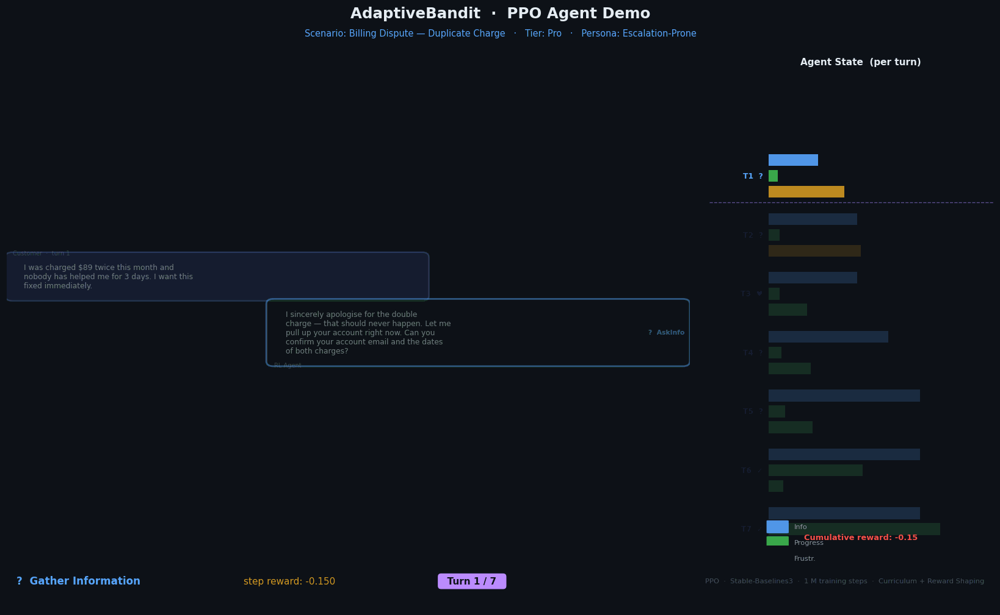
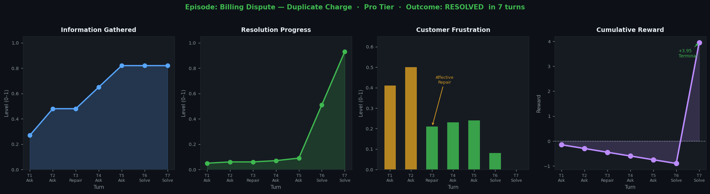
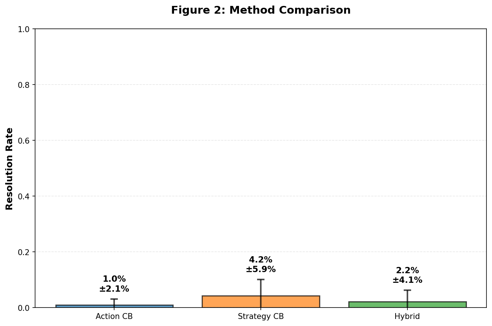
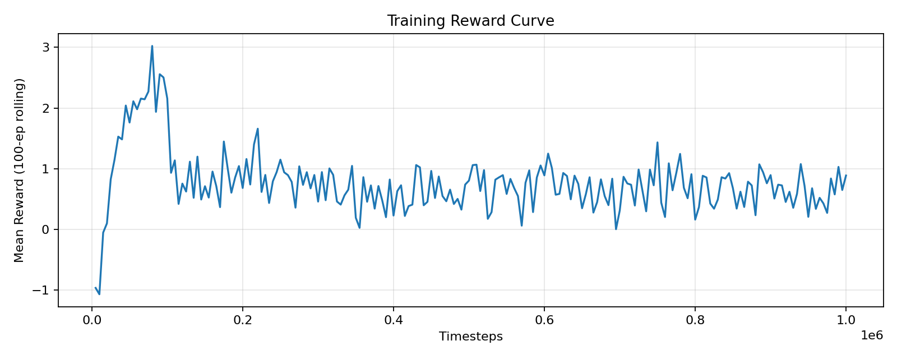
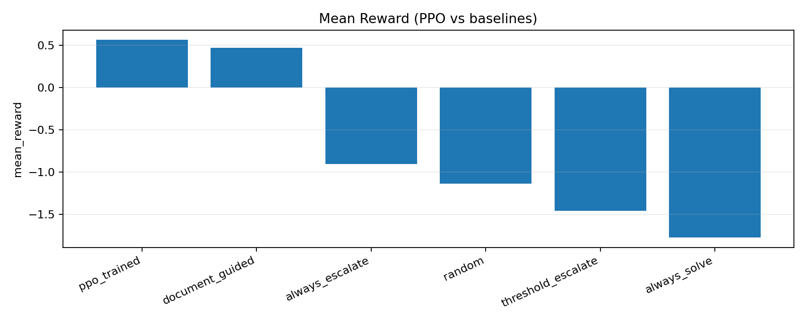
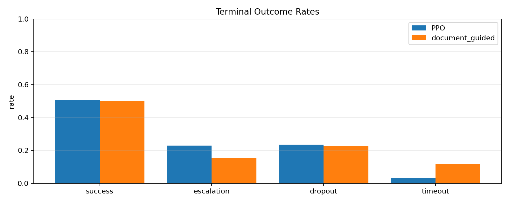
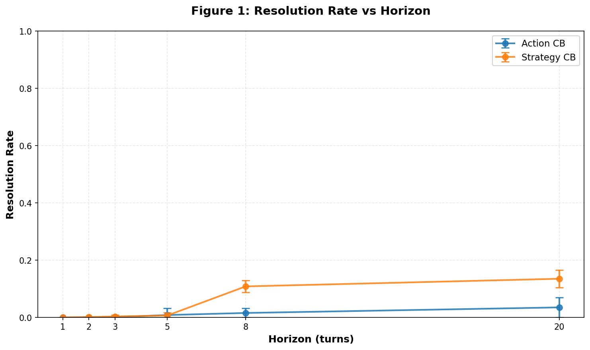

# AdaptiveBandit — RL for Real-Time Decision Support in Customer Service

> **Three complementary RL approaches** — contextual bandits, numerical PPO, and LLM-augmented PPO — trained on a multi-turn customer support simulator grounded in the ABCD dataset.


---

## Demo — RL Agent Resolving a Billing Dispute

The agent learns when to gather information, repair customer sentiment, and provide solutions — all optimized against a reward model based on customer churn risk and lifetime value.



*7-turn episode: Pro-tier customer with duplicate charge. Agent gathers info, performs affective repair at peak frustration (turn 3), then resolves cleanly. Terminal reward: +4.85.*



---

## Contents

- [Quick Start](#quick-start)
- [The Three Approaches](#the-three-approaches)
- [MDP & Reward Model](#mdp--reward-model)
- [Training Results](#training-results)
- [File Structure](#file-structure)
- [Output Structure](#output-structure)
- [Running Approaches Individually](#running-approaches-individually)
- [Hardware Notes](#hardware-notes)
- [Dataset](#dataset)
- [Dependencies](#dependencies)

---

## Quick Start

```bash
# 1. Clone the repo
git clone https://github.com/<your-username>/AdaptiveBandit--Contextual-Bandits-for-Real-Time-Decision-Support-in-Customer-Service.git
cd AdaptiveBandit--Contextual-Bandits-for-Real-Time-Decision-Support-in-Customer-Service

# 2. Run everything — one command
bash run.sh
```

`run.sh` handles everything: creates a Python virtual environment, installs dependencies, runs all three approaches in sequence, and saves all results under `output/`. **No manual setup required.**

The runner is **idempotent** — if an approach already has output, it is skipped. Delete the folder to re-run.

### Adjusting run parameters

```bash
# Quick smoke-test (much faster)
NUM_TIMESTEPS_NUMERICAL=50000 bash run.sh

# Full production run
NUM_TIMESTEPS_NUMERICAL=1000000 NUM_TIMESTEPS_NLG=5000 bash run.sh
```

| Variable | Controls | Default |
|---|---|---|
| `NUM_TIMESTEPS_NUMERICAL` | PPO steps, numerical RL | 1,000,000 |
| `NUM_TIMESTEPS_NLG` | PPO steps, NLP mode | auto (5000 GPU / 100 CPU) |
| `CB_COLLECT_EPISODES` | Bandit data collection episodes | 300 |
| `CB_EVAL_EPISODES` | Bandit evaluation episodes | 200 |
| `EVAL_EPISODES` | Evaluation episodes (numerical/NLP) | 200 |
| `N_ENVS` | Parallel training environments | 1 |
| `PYTHON_BIN` | Python executable | `python3` |

---

## The Three Approaches

### Approach 1 — Contextual Bandits

A bandit agent that treats each conversation turn as an independent context-action-reward problem. Three exploration strategies are benchmarked:

| Algorithm | Strategy |
|---|---|
| **LinUCB** | Upper Confidence Bound with linear reward model (α = 1.0) |
| **Linear Thompson Sampling** | Bayesian posterior sampling (v = 0.5) |
| **ε-Greedy** | Greedy exploitation with ε = 0.20 random exploration |

A **truncated-horizon hybrid policy** blends bandit recommendations with a document-guided fallback in early turns.

The bandit context vector is extracted from the public environment state: sentiment, frustration, information proxy, failed streak, turn fraction, and last-action features.

**Run standalone:** `bash scripts/train_bandit.sh`  
**Output:** `output/contextual-bandit/`



---

### Approach 2 — Numerical Multi-Turn PPO

A full episodic RL agent trained with PPO over the complete multi-turn MDP. No LLM involved — the environment runs as a fast numeric simulator.

**Action space (Discrete 5):**

| ID | Action | Effect |
|---|---|---|
| 0 | **AskInfo** | Gather information from the customer |
| 1 | **ProvideSolution** | Attempt to resolve the issue |
| 2 | **AffectiveRepair** | De-escalate emotionally, reduce frustration |
| 3 | **Escalate** | Hand off to a human agent (terminal) |
| 4 | **Close** | End the conversation (terminal) |

**Observation space (Box 9,)** — features the agent can infer from dialogue:

| Feature | Description |
|---|---|
| sentiment | Inferred dialogue tone |
| frustration_trend | Rising or falling frustration |
| frustration | Current customer frustration level |
| info_proxy | Information gathered so far |
| failed_streak / 5 | Consecutive failed solution attempts |
| turn_count / T_max | Episode progress |
| last_action_norm | Previous action taken |
| last_success | Whether the last action succeeded |
| resolved | Issue resolved flag |

**PPO hyperparameters:**

| Parameter | Value |
|---|---|
| Policy network | MlpPolicy — [128, 128, 64], Tanh |
| n_steps | 2048 |
| batch_size | 256 |
| n_epochs | 10 |
| learning_rate | 3 × 10⁻⁴ |
| γ (discount) | 0.99 |
| GAE λ | 0.95 |
| clip range | 0.2 |
| entropy coefficient | 0.05 |

**Training enhancements:**
- **Curriculum learning** — starts with easy subflows (difficulty ≤ 0.85), adds intermediate at 100k steps, opens to all subflows at 300k steps. Difficulty derived from mean action counts in ABCD.
- **Potential-based reward shaping** — `r'_t = r_t + γΦ(s') − Φ(s)`, policy-invariant by construction.
- **Action masking** — Escalate blocked in turns 1–3 unless frustration > 0.75 and failed_streak ≥ 2.

**Run standalone:** `bash scripts/train_numerical.sh`  
**Output:** `output/numerical-multi-turn/`, `best_model/numerical/`

---

### Approach 3 — NLG Multi-Turn PPO

The same PPO loop augmented with a live LLM generating realistic customer utterances at each turn via an `NLGLayer`. The agent's observation vector is unchanged — the LLM conditions the environment's frustration dynamics and state transitions, making each episode driven by actual natural language.

**LLM:** [`abhi6168/ABCD_CustomerAgent_Qwen_2.5_7b`](https://huggingface.co/abhi6168/ABCD_CustomerAgent_Qwen_2.5_7b) — Qwen 2.5 7B fine-tuned on the ABCD customer service dataset.

**Backend options:**

| Backend | Activation | Notes |
|---|---|---|
| HuggingFace (default) | `HF_MODEL_PATH=abhi6168/ABCD_CustomerAgent_Qwen_2.5_7b` | Downloads from Hub on first run |
| Local snapshot | `HF_MODEL_PATH=/path/to/model` | Use pre-downloaded weights |
| Ollama | `OLLAMA_MODEL=llama3` | Requires `ollama serve` locally |

**Run standalone:** `bash scripts/train_nlp.sh`  
**Output:** `output/nlp-multi-turn/`, `best_model/nlp/`

> **Hardware note:** see [Hardware Requirements](#hardware-notes) below.

---

## MDP & Reward Model

All three approaches share the same environment and reward function.

**Environment:** `SupportEnv` (Gymnasium) — `multiturn_rl/simulation/env/support_env.py`

| Property | Value |
|---|---|
| Max turns per episode | 20 |
| Terminal states | success, escalation, dropout, timeout |

**Reward function** (`multiturn_rl/simulation/env/reward_engine.py`):

```
r_turn     = −0.15                        (per-step cost — discourages long conversations)
r_terminal = −ω · p_churn · V(tier) + outcome_bonus
```

The churn probability is a logistic model over conversation state:

```
logit(p_churn) = −3.8 + 3.0·frustration + 0.1·failed_streak + 0.08·turn_count − 1.5·τ
```

`τ` is the customer's persona-level failure tolerance. `V(tier)` is customer lifetime value, scaling from Free → Enterprise.

**Terminal outcome bonuses:**

| Outcome | Reward |
|---|---|
| Success | +5.0 (p_churn forced to 0) |
| Dropout | Churn loss at p_churn = 1.0 (worst case) |
| Unresolved close | −1.0 additional penalty |
| Escalation | Context-sensitive: penalizes premature escalation, rewards it when frustration is high and solutions have failed |
| Timeout | Churn loss from model |

All rewards are clipped to [−5.0, +5.0].

---

## Training Results

### Numerical PPO (1M steps, 200-episode eval)

| Policy | Mean Reward | Resolution Rate | Escalation Rate |
|---|---|---|---|
| **PPO (trained)** | **+0.56** | **50.5%** | 23.0% |
| Document-guided (baseline) | +0.47 | 50.0% | 15.5% |
| Always-escalate | −0.90 | 0.0% | 100% |
| Random | −1.14 | 1.0% | 51.0% |
| Always-solve | −1.77 | 10.5% | 0.0% |

PPO beats the best rule-based baseline and learns sensible escalation behaviour (escalates at high frustration/failed-streak, not on fresh conversations).







### Contextual Bandits



---

## File Structure

```
.
├── run.sh                          # Single-command end-to-end runner
├── requirements.txt                # Core deps (numpy, gymnasium, SB3, faiss-cpu, ...)
├── requirements-llm.txt            # LLM deps (transformers, accelerate, ...)
│
├── Contextual Bandits/             # Approach 1 — bandit algorithms
│   ├── main.py                     # Entry point
│   ├── linucb.py                   # LinUCB
│   ├── thompson_sampling.py        # Linear Thompson Sampling
│   ├── epsilon_greedy.py           # ε-Greedy
│   ├── truncated_policy_hybrid.py  # Hybrid bandit + document-guided policy
│   ├── env_factory_FINAL.py        # Bandit context extraction wrapper
│   ├── bandit_metrics.py           # Per-turn metrics + episode outcome stats
│   └── plot_bandit_results.py      # Plot generation
│
├── multiturn_rl/                   # Approaches 2 & 3 — episodic RL
│   ├── simulation/
│   │   ├── env/
│   │   │   ├── support_env.py          # Gymnasium environment + episode loop
│   │   │   ├── state_engine.py         # State transition dynamics
│   │   │   ├── reward_engine.py        # Reward function + churn model
│   │   │   ├── nlg_layer.py            # LLM-backed customer utterance generation
│   │   │   ├── intent_classifier.py    # Customer intent classification
│   │   │   ├── agent_response_generator.py
│   │   │   └── slot_tracker.py         # Slot filling for subflow completion
│   │   ├── training/
│   │   │   ├── train_ppo.py            # PPO config and training loop
│   │   │   ├── curriculum.py           # Difficulty scheduler
│   │   │   ├── callbacks.py            # SB3 callbacks (eval, curriculum)
│   │   │   ├── reward_shaping.py       # Potential-based shaping wrapper
│   │   │   └── action_masking.py       # Early-turn escalation mask
│   │   ├── rag/
│   │   │   ├── lumo_rag.py             # RAG retriever over ABCD documents
│   │   │   ├── document_store.py       # FAISS index management
│   │   │   └── scenario_generator.py   # Episode scenario generation
│   │   ├── validation/
│   │   │   ├── baseline_policies.py    # Random / document-guided / always-X baselines
│   │   │   ├── level1_statistical.py
│   │   │   ├── level2_transition.py
│   │   │   ├── level3_rl_signal.py
│   │   │   └── level4_rag_coverage.py
│   │   └── scripts/
│   │       └── phase10_full_pipeline.py  # Train + eval + demo rollouts pipeline
│   │
│   └── Simulation_4/               # NLG training variant (Qwen integration)
│       ├── training/
│       └── rl_training_server/
│           └── scripts/
│               └── train_rl_qwen.py    # NLG PPO pipeline entry point
│
├── scripts/
│   ├── common.sh           # Shared venv setup + path exports
│   ├── train_numerical.sh  # Standalone numerical PPO runner
│   ├── train_nlp.sh        # Standalone NLG PPO runner
│   └── train_bandit.sh     # Standalone bandit runner
│
├── tools/
│   ├── export_multiturn_results.py  # Exports artifacts to output/
│   ├── generate_demo.py             # Generates demo GIF + summary PNG
│   └── download_qwen_model.py       # Pre-download Qwen model snapshot
│
├── assets/                 # Images embedded in this README
├── demo/                   # Demo GIF and episode summary PNG
│
├── best_model/
│   ├── numerical/          # best_model.zip + final_model.zip
│   └── nlp/                # best_model.zip + final_model.zip
│
└── output/                 # All results (generated by run.sh)
    ├── contextual-bandit/
    ├── numerical-multi-turn/
    └── nlp-multi-turn/
```

---

## Output Structure

After `bash run.sh`:

```
output/
    contextual-bandit/
        training_summary.json
        plots/

    numerical-multi-turn/
        training_summary.json       # Best reward, resolution rate, runtime
        training_log.json           # Per-checkpoint metrics
        full_pipeline_report.json   # Training + evaluation + baseline comparison
        leaderboard.json
        demo_rollouts.json          # 12 annotated episode traces
        models/
            best_model.zip
            final_model.zip
        plots/
            reward_curve.png
            resolution_curve.png
            eval_curve.png
            mean_reward_leaderboard.png
            terminal_outcomes.png

    nlp-multi-turn/
        training_summary.json
        training_log.json
        full_pipeline_report.json
        models/  plots/

best_model/
    numerical/   nlp/
```

---

## Running Approaches Individually

```bash
# Contextual bandits only
bash scripts/train_bandit.sh

# Numerical PPO only
NUM_TIMESTEPS=1000000 bash scripts/train_numerical.sh

# NLG PPO — HuggingFace backend (downloads model on first run)
HF_MODEL_PATH=abhi6168/ABCD_CustomerAgent_Qwen_2.5_7b bash scripts/train_nlp.sh

# NLG PPO — Ollama backend (requires ollama running locally)
OLLAMA_MODEL=llama3 bash scripts/train_nlp.sh

# Pre-download the Qwen model to avoid downloading during training
python tools/download_qwen_model.py \
  --repo-id abhi6168/ABCD_CustomerAgent_Qwen_2.5_7b \
  --dst path/to/local/model

# Regenerate the demo GIF and summary PNG
python tools/generate_demo.py
```

---

## Hardware Notes

| Approach | Min RAM | GPU | Approx. training time (1M steps) |
|---|---|---|---|
| Contextual Bandits | 4 GB | Not required | < 10 min |
| Numerical PPO | 8 GB | Not required | ~20–30 min (CPU) |
| NLG PPO | **32 GB** | Strongly recommended | ~10 days (NVIDIA A6000) |

**NLG training details:**
- The 7B Qwen model is loaded for inference at every environment step, making each step ~100× slower than numerical mode.
- On CPU-only hardware, `run.sh` automatically limits NLG to a 5-step demo to verify the pipeline without running out of memory.
- **Graceful interruption:** pressing `Ctrl+C` or sending `SIGTERM` at any point triggers a clean shutdown that saves all in-progress checkpoints and output artifacts before exiting.

---

## Dataset

The simulator is grounded in **ABCD** (Action-Based Conversations Dataset) — a dataset of 10,000 multi-turn customer support dialogues with annotated subflows and agent actions. Subflow difficulty (used for curriculum learning) is derived from mean action counts across ABCD episodes.

RAG documents are pre-indexed at `multiturn_rl/simulation/rag/` and `multiturn_rl/Simulation_4/rag/`.

---

## Dependencies

```bash
# Core (all approaches)
pip install -r requirements.txt

# NLG approach only
pip install -r requirements-llm.txt
```

Core: `stable-baselines3 >= 2.2.1`, `gymnasium >= 0.29`, `faiss-cpu >= 1.7`, `numpy`, `pandas`, `matplotlib`

NLG: `transformers >= 4.40`, `accelerate >= 0.29`, `huggingface_hub >= 0.20`, `sentencepiece >= 0.2`
